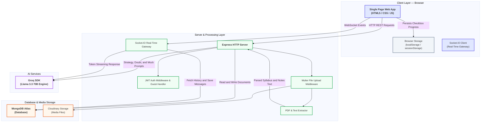
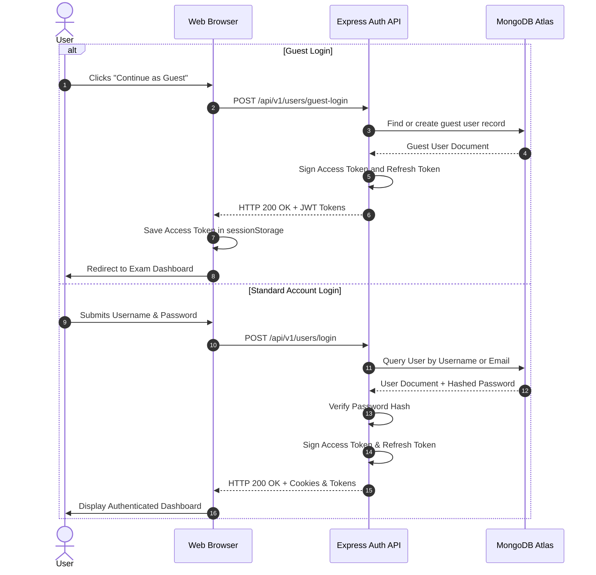
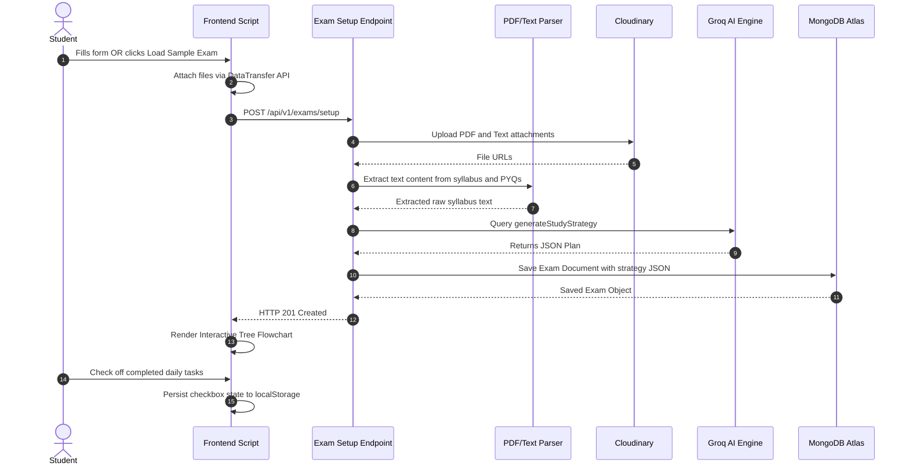
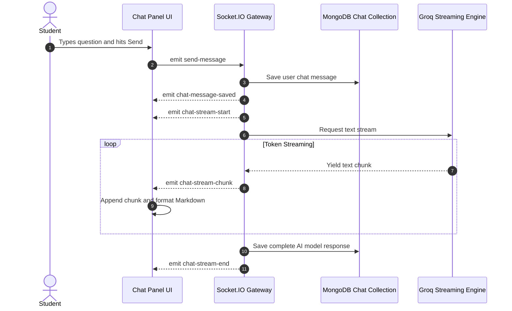
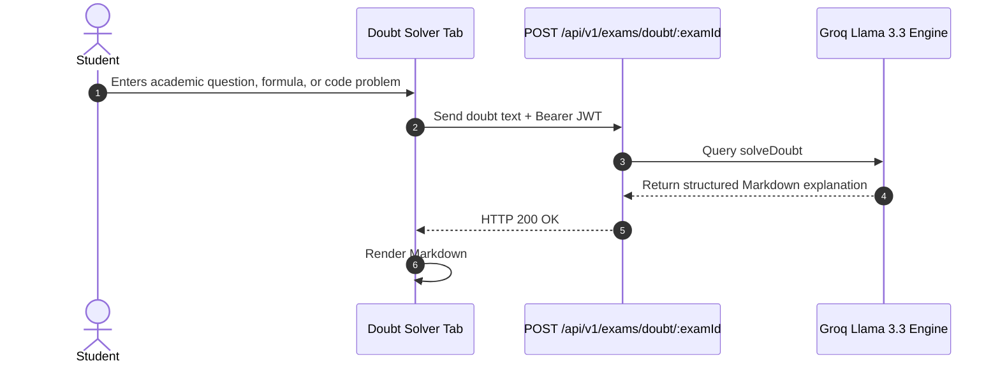
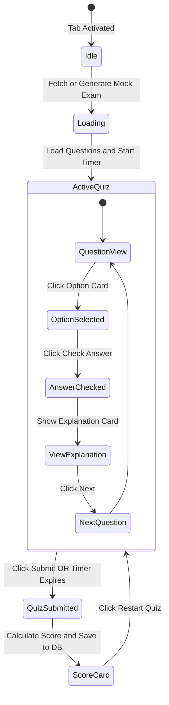

# PrepOS — Smart Exam Preparation Platform

**PrepOS** is an intelligent academic preparation platform designed to convert raw course syllabi, past year question papers (PYQs), and study notes into structured, interactive study roadmaps, real-time doubt explanations, and adaptive mock assessments.

The Node backend integrates with the Python `ai_services` application through `AI_SERVICES_URL`. Set it to the running FastAPI service, for example `http://127.0.0.1:8001`, and start that service with `uvicorn ai_services.main:app --port 8001`. Set `AI_SERVICES_ENABLED=false` to use the legacy Groq implementation instead. The Python service supports local Qdrant by default and Qdrant Cloud through `ALE_QDRANT_URL` and `ALE_QDRANT_API_KEY`.

- **Developer:** Suryansh Khare
- **Backend Runtime:** Node.js (Express 5 + Socket.IO)
- **Live on:** https://prep-os-live.onrender.com
- **Deployed and Shipped with 24 x 7 running capability**

## System Architecture

The following diagram illustrates the end-to-end data flow between the single-page frontend client, the Node.js/Express API layer, MongoDB storage, Cloudinary file pipeline, and the Groq LLM inference service.



---

## Core Workflows and Sequence Diagrams

### 1. User Authentication and Guest Login Flow

PrepOS supports standard JWT account registration/login as well as a zero-friction **"Continue as Guest"** session initialization.



---

### 2. Exam Setup and Interactive Strategy Flowchart Generation

When a user submits an exam configuration (or clicks **Load Sample Exam**), the system extracts raw document text, constructs an engineering prompt, queries Groq Llama 3.3 70B for a structured JSON strategy, and renders an interactive tree flowchart.



---

### 3. Real-Time Q&A Chat Streaming via Socket.IO

The QA Chat module uses WebSockets to stream AI responses token-by-token back to the client while storing history in MongoDB.



---

### 4. Doubt Solver Workflow



---

### 5. Mock Exam Engine State Machine



---

## Repository Directory Structure

```
Prep_os-Live/
├── .env                              # Environment variables
├── .gitignore                        # Git ignore rules
├── render.yaml                       # Render deployment manifest
├── index.js                          # Node.js server entry point
├── app.js                            # Express configuration & middleware
├── constants.js                      # System database name constant
├── package.json                      # Node package manifest
├── package-lock.json                 # Dependency lockfile
├── Readme.md                         # Project documentation
│
├── client/                           # Frontend Application
│   ├── index.html                    # Main HTML markup
│   ├── script.js                     # Application logic & DOM state
│   ├── style.css                     # Minimalist stylesheet
│   └── exam_prp.html                 # Page template
│
├── server/                           # Backend Application
│   ├── public/
│   │   └── temp/                     # Temporary upload directory
│   └── src/
│       ├── controllers/
│       │   ├── exam.controller.js    # Exam & AI business logic
│       │   └── user.controller.js    # Auth & guest session logic
│       ├── db/
│       │   └── index.js              # Database connection helper
│       ├── middlewares/
│       │   ├── auth.middleware.js    # JWT auth verification
│       │   └── multer.middleware.js  # File upload middleware
│       ├── models/
│       │   ├── user.model.js         # User model schema
│       │   ├── exam.model.js         # Exam schema
│       │   ├── mocktest.model.js     # Quiz schema
│       │   ├── chat.model.js         # Chat history schema
│       │   └── subscription.model.js # Subscription schema
│       ├── routes/
│       │   ├── exam.routes.js        # Exam API endpoints
│       │   └── user.routes.js        # User auth API endpoints
│       ├── utils/
│       │   ├── ApiError.js           # Custom API Error class
│       │   ├── ApiResponse.js        # JSON response helper
│       │   ├── asyncHandler.js       # Controller wrapper
│       │   ├── cloudinary.js         # Media storage helper
│       │   └── gemini.js             # Groq SDK AI helper
│       └── socket.js                 # Socket.IO connection handler
│
└── testing_materials/                # Sample test data
    ├── notes.txt
    ├── pyq_2025.txt
    └── syllabus.txt
```

---

## REST API Reference

### User Authentication (`/api/v1/users`)

| Method | Endpoint | Auth | Description |
| :--- | :--- | :--- | :--- |
| `POST` | `/register` | Public | Registers a new user account |
| `POST` | `/login` | Public | Authenticates user and issues JWT tokens |
| `POST` | `/guest-login` | Public | Authenticates or provisions a Guest session |
| `POST` | `/logout` | Bearer JWT | Revokes tokens and clears auth cookies |
| `GET` | `/me` | Bearer JWT | Returns current authenticated user profile |
| `POST` | `/refresh-token` | Public | Issues a new access token via refresh token |

### Exam and AI Services (`/api/v1/exams`)

| Method | Endpoint | Auth | Description |
| :--- | :--- | :--- | :--- |
| `POST` | `/setup` | Bearer JWT | Uploads files, extracts text, and generates study strategy |
| `GET` | `/list` | Bearer JWT | Retrieves all exams created by the active user |
| `GET` | `/strategy/:examId` | Bearer JWT | Fetches study strategy JSON for a given exam |
| `POST` | `/doubt/:examId` | Bearer JWT | Resolves an academic doubt with formatted Markdown |
| `GET` | `/mock/:examId` | Bearer JWT | Fetches or generates 5-question MCQ mock test |
| `POST` | `/mock/:examId/submit` | Bearer JWT | Submits final mock exam score and saves results |
| `GET` | `/chat/:examId` | Bearer JWT | Retrieves past chat message history for an exam |

---

## Local Installation and Development

### 1. Clone Repository and Install Dependencies
```bash
git clone https://github.com/Ayushkhar/Prep_os-Live.git
cd Prep_os-Live
npm install
```

### 2. Configure Environment Variables
Create a `.env` file in the root directory:

```env
PORT=3000
MONGODB_URI=mongodb+srv://<username>:<password>@<cluster>.mongodb.net/
GROQ_API_KEY=your_groq_api_key
CLOUDINARY_API_KEY=your_cloudinary_api_key
CLOUDINARY_API_SECRET=your_cloudinary_api_secret
CLOUDINARY_KEY_NAME=your_cloudinary_cloud_name
ACCESS_TOKEN_SECRET=your_jwt_access_secret
ACCESS_TOKEN_EXPIRY=1d
REFRESH_TOKEN_SECRET=your_jwt_refresh_secret
REFRESH_TOKEN_EXPIRY=10d
CORS_ORIGIN=*
```

### 3. Run Application Locally
```bash
npm start
```
Open **[http://localhost:3000](http://localhost:3000)** in your browser.

---

## Cloud Deployment

This repository includes a pre-configured `render.yaml` manifest.

1. Create a new **Web Service** on Render.
2. Connect your GitHub repository `Ayushkhar/Prep_os-Live`.
3. Render automatically loads build (`npm install`) and start (`npm start`) commands.
4. Add environment variables in Render's **Environment** section.
5. Click **Deploy**.

---

## Author

**Suryansh Khare**
- GitHub: [https://github.com/Ayushkhar](https://github.com/Ayushkhar)
- Live Portal: [prep-os-live.onrender.com](https://prepos.suryanshkhare.online)
